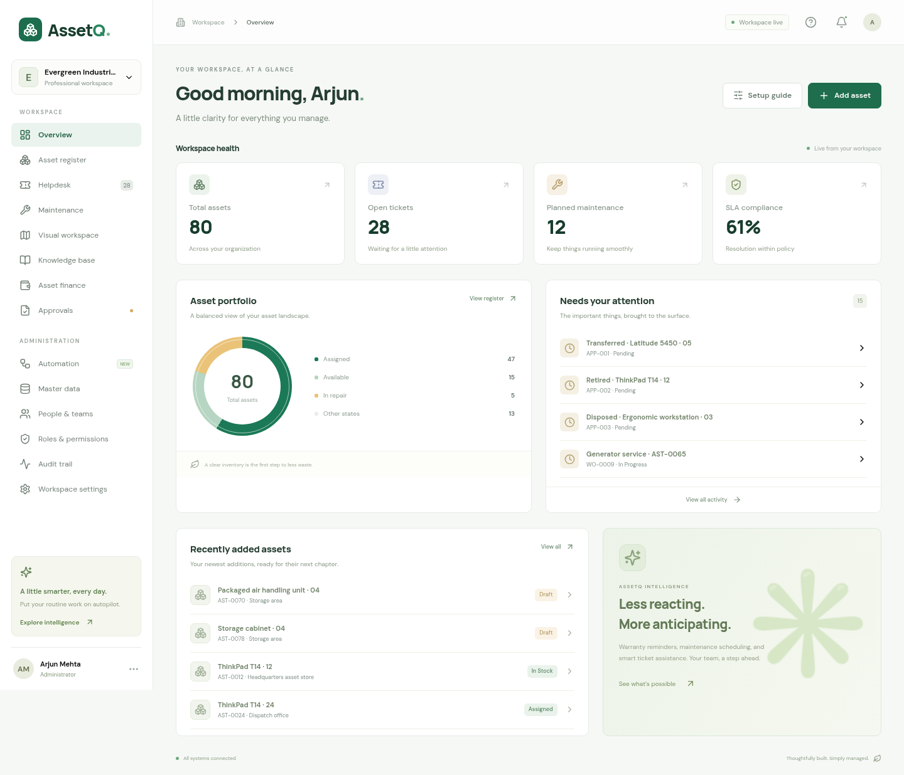

# Evergreen Industries — complete AssetQ sample company

This is fictional demonstration data. No real employee, supplier, serial number, or customer credential is included. Purchase management remains excluded.

## Start on Windows

Download the latest project ZIP from GitHub and extract it. Double-click **START_ASSETQ_DEMO.bat**. This installs dependencies, loads this company, and starts AssetQ against a separate demo database. Keep the command window open and use the Local browser address shown there.

Node.js LTS (22.12+) and Python 3.12+ are required. The standard **START_ASSETQ.bat** continues to open your ordinary customer database; it does not load demo data.

## Logins

Workspace ID: **evergreen-demo**  
Initial password for every fictional account: **AssetQDemo!2026**

| Role                   | Person       | Email                                  |
| ---------------------- | ------------ | -------------------------------------- |
| Administrator          | Arjun Mehta  | `admin@evergreen.example.test`         |
| Asset manager          | Priya Sharma | `asset.manager@evergreen.example.test` |
| Helpdesk agent         | Neha Kapoor  | `helpdesk@evergreen.example.test`      |
| Employee               | Ananya Reddy | `employee@evergreen.example.test`      |
| Auditor                | Ishita Bose  | `auditor@evergreen.example.test`       |
| Finance analyst        | Meera Nair   | `finance@evergreen.example.test`       |
| Maintenance technician | Sanjay Verma | `technician@evergreen.example.test`    |

All 30 accounts, departments, and site assignments are listed in **users.csv** and the **Users** tab of **Evergreen-Company-Data.xlsx**. These are public demo credentials intended for local testing. Do not expose the demo database as a real customer service with these passwords.

## Contents

- 1 company; 3 sites and 26 hierarchical locations; 8 departments/cost centers.
- 30 active users across 7 roles, including finance and maintenance-specific roles.
- 80 assets across 12 categories and 18 models, with assignments, serials, locations, warranty dates, costs, verification, and depreciation classes.
- 36 tickets spanning new, assigned, in progress, pending, resolved, closed, and reopened states.
- 20 maintenance work orders, including completed checklists and overdue/upcoming work.
- 7 approval scenarios: transfer, retirement, disposal, approved, rejected, and pending examples. Different users handle requests and reviews.
- 6 vendors, 8 service/warranty contracts, 5 SLA policies, 6 services, 6 depreciation classes, 3 tax codes, 6 checklists, and 10 knowledge articles.
- 3 sample floor-plan PNGs with correctly scoped asset markers.
- 11 enabled automation rules. Loading generates in-app notifications and audit history, including warranty/SLA warnings and recurring-incident examples.

**Evergreen-Company-Data.xlsx** contains one worksheet per module, including logins, rules, notifications, and audit history. **company-data.json** contains the full fictional export; module CSVs can also be opened individually in Excel. Historical statuses and internal relationships mean these CSVs are not a substitute for the complete-company loader. Notifications, audit logs, and automation defaults are generated through the existing application code when the company is loaded.

Dates in the repository export are anchored to **2026-10-07**. A new local demo installation computes its dates relative to the day it is first loaded. Rerunning the loader preserves the existing company, user edits, and password changes; it never resets existing data.

## Command-line alternative

From the project directory:

```sh
npm ci
npm run demo
```

Or load data without starting a server:

```sh
npm run demo:seed
```

Default demo database: `.data/assetq-demo.sqlite3`. Demo services use API port 8050 and UI port 5180 so they can run alongside the regular application. Starting a demo while the demo ports already serve a different database is rejected.

## Try these scenarios

1. Sign in as administrator and inspect all users, roles, masters, and the populated dashboard.
2. Sign in as an employee; inspect only their assigned assets and tickets, then raise a new request.
3. As helpdesk agent, open a laptop incident, request local assistance, and add a reply. Suggestions are rule-based unless you separately configure an AI provider.
4. As maintenance technician, complete every checklist step and record findings on a scheduled work order; verify the next service date.
5. As asset manager, review the pending transfer or retirement requests. Submit a new request, then switch to the other asset manager to approve it.
6. As finance analyst, inspect INR book-value estimates and depreciation by class.
7. As auditor, inspect the generated event history.
8. Open Visual workspace and click a placed asset marker. Run automation twice; existing reminders and work orders are deduplicated.

## Preview


